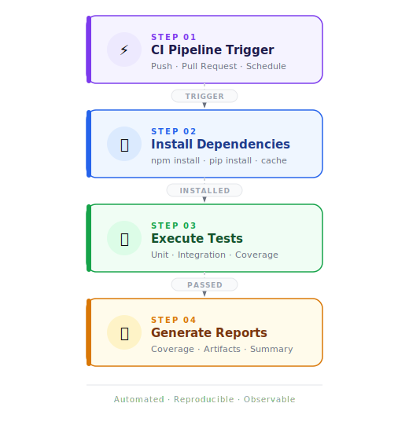

# Automation Engineering Framework – JavaScript Ecosystem

This project demonstrates the design and implementation of a **modular Test Automation Framework architecture** built within the JavaScript ecosystem.

The goal of this framework is to showcase **real-world automation engineering practices**, including UI automation, API testing, BDD testing strategies, reporting, and CI/CD integration.

This repository acts as the **central documentation hub** for the automation solutions implemented across multiple repositories.

---

# Framework Architecture

The automation framework follows a **modular architecture**, where each module represents a specific automation capability.

Automation modules are implemented across the following repositories:

| Repository | Purpose |
|------------|--------|
| Specialization_AT_JS_Scenarios | UI automation framework with WebdriverIO, BDD, and Page Object Model |
| Specialization_AT_JS_Testing_WebServices | REST API testing framework with schema validation |
| Specialization_AT_JS_Results_Reporting | Test reporting integration and code quality tooling. Jenkins CI pipeline executing automated tests |
| Specialization_AT_JS_Chai | Assertion strategies using Chai |
| Automation-Engineering-JS-Framework | Framework architecture documentation |

# Project Structure Example

```
src
├── business/po
│   ├── pages
│   └── step-definitions
├── core
│   ├── base
│   └── helpers
└── test
    ├── data
    └── features

```
- **Core layer:** framework utilities and shared functionality
- **Business layer:** page objects and business logic
- **Tests layer:** automated UI and API test scenarios

# Automation Stack
- **Automation Framework:** Playwright
- **Language:** JavaScript
- **Architecture:** Page Object Model (POM)
- **API Testing:** Playwright API / REST validation
- **Reporting:** Allure Reports, HTML reports
- **CI/CD:** Jenkins, GitHub Actions
- **Code Quality:** ESLint, Prettier
- **Execution:** Parallel cross-browser testing
- **Environment:** Node.js, Docker, WSL2

# Implemented Automation Features

Across these repositories, the framework demonstrates the implementation of **nine key automation features commonly used in real-world automation environments.**

## 1. Page Object Model (POM)

Implemented to separate **test logic from UI element locators**, improving maintainability and test readability.

Benefits:

- Reusable UI components
- Reduced code duplication
- Easier test maintenance

Repository:
[Specialization_AT_JS_Scenarios](https://github.com/ElianaMendez/Specialization_AT_JS_Scenarios)
Branch: main

---

## 2. BDD Test Design with Cucumber

Tests are written using **Behavior Driven Development (BDD)** scenarios.

Example structure:

**Feature:** Product Details on Practice Software Testing 
As a customer I want to view detailed product information on https://practicesoftwaretesting.com/ So that I can make informed purchase decisions 

**Scenario:** User views details of a selected product 

**Given** the user is on the Practice Software Testing home page 
**When** the user clicks on a product title or image 
**Then** the system should display the product details page 
**And** the page should show the product name, price, and description 


Benefits:

- Improved collaboration between QA, developers, and stakeholders
- Human-readable test scenarios
- Better documentation of system behavior

Repository:
[Specialization_AT_JS_Scenarios](https://github.com/ElianaMendez/Specialization_AT_JS_Scenarios)
Branch: main

---

## 3. UI Automation using WebdriverIO

Automated UI tests validate application behavior across different browser environments.

Capabilities demonstrated:

- Browser interaction
- Element validation
- Navigation flows
- Test retries
- Parallel execution

Repository:
[Specialization_AT_JS_Scenarios](https://github.com/ElianaMendez/Specialization_AT_JS_Scenarios)
Branch: main

---

## 4. API Automation Testing

API tests validate backend services through REST endpoints.

Operations tested include:

- Create resource
- Retrieve resource
- Update resource
- Delete resource

Validations include:

- HTTP status codes
- Response body validation
- Header validation
- Response structure validation

Repository:
[Specialization_AT_JS_Testing_WebServices](https://github.com/ElianaMendez/Specialization_AT_JS_Testing_WebServices)
Branch main


---

## 5. Assertion Strategies with Chai

Different assertion interfaces were implemented to validate application behavior.

Interfaces used:

- Assert
- Expect
- Should

Repository:
[Specialization_AT_JS_Chai](https://github.com/ElianaMendez/Specialization_AT_JS_Chai)
Branch: main


---

## 6. Test Result Reporting

Automation tests generate structured execution reports.

Reports include:

- Passed tests
- Failed tests
- Execution duration
- Error stack traces

Repository:
[Specialization_AT_JS_Results_Reporting](https://github.com/ElianaMendez/Specialization_AT_JS_Results_Reporting)
Branch: feature/reports


---

## 7. Code Quality Enforcement

The framework enforces coding standards using tools such as:

- ESLint
- Prettier

Benefits:

- Consistent code style
- Reduced technical debt
- Improved readability

Repository:
[Specialization_AT_JS_Results_Reporting](https://github.com/ElianaMendez/Specialization_AT_JS_Results_Reporting)
Branch: feature/formatting

---

## 8. Modular Test Architecture

The framework is designed with **modularity in mind**, allowing individual components to evolve independently.

Architecture principles used:

- Separation of concerns
- Reusable test utilities
- Layered testing structure

Repository:
[Specialization_AT_JS_Scenarios](https://github.com/ElianaMendez/Specialization_AT_JS_Scenarios)
Branch: feature/refactor

---

## 9. CI/CD Integration

Automation tests are designed to be executed as part of **continuous integration pipelines**.

**GitHub Actions**
Repository:
[Specialization_AT_JS_Scenarios](https://github.com/ElianaMendez/Specialization_AT_JS_Scenarios)
Branch: feature/typescript

**Jenkins pipelines**
Repository:
[Specialization_AT_JS_Results_Reporting](https://github.com/ElianaMendez/Specialization_AT_JS_Results_Reporting)
Branch: feature/ci-jenkins

Typical workflow:





Jenkins pipelines utilized the following stack for execution:


---

# Framework Design Principles

The framework implementation follows several **software engineering and test automation best practices.**

## Separation of Concerns

Test logic, test data, and UI interactions are separated into distinct layers.

## Reusability

Shared components such as page objects and utilities can be reused across multiple tests.

## Maintainability

The architecture minimizes coupling between components to allow easier updates.

## Scalability

The modular design allows the framework to scale as the test suite grows.

---

# How to Run the Automation Tests

## 1 Install dependencies
```
npm install
```

---

## 2 Execute UI tests
```
npm run test:api
```

---

## 4 Generate reports
```
npm run report
```

# Author

Eliana Méndez

QA Engineer specializing in **Automation Engineering within the JavaScript ecosystem**, focused on building scalable test automation frameworks and improving software quality through automation strategies.


